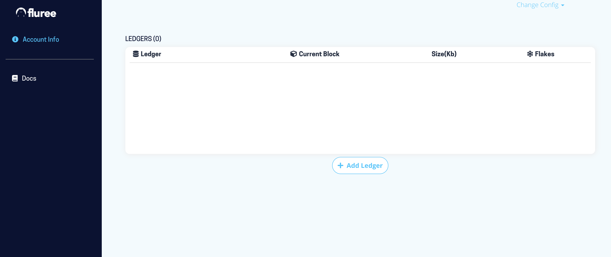
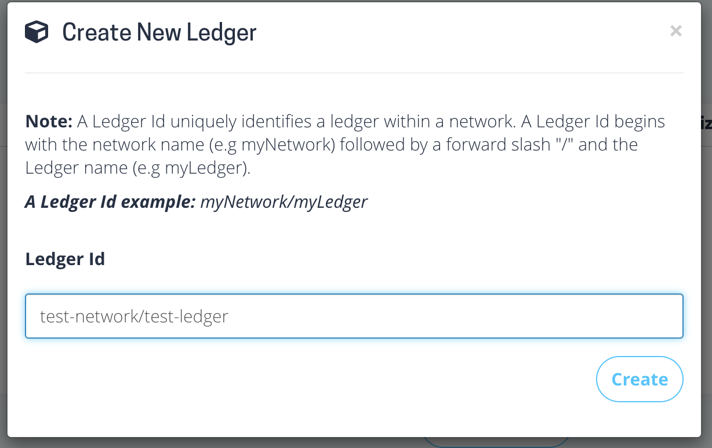
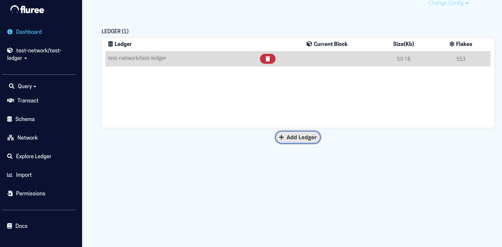
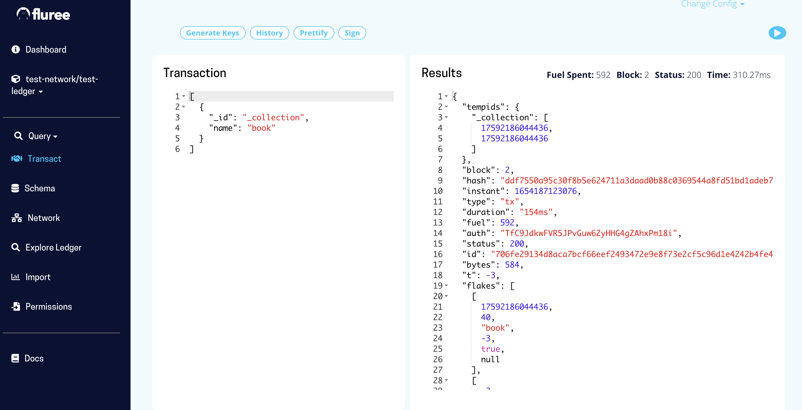
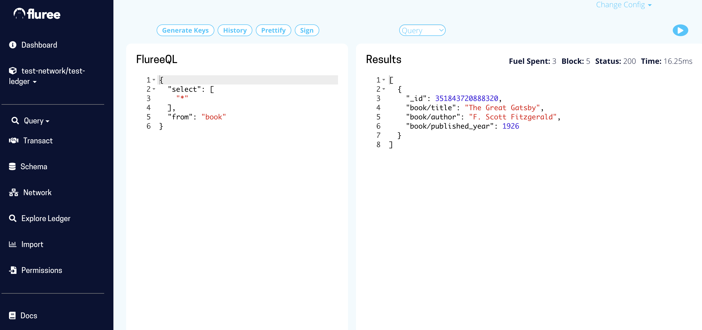
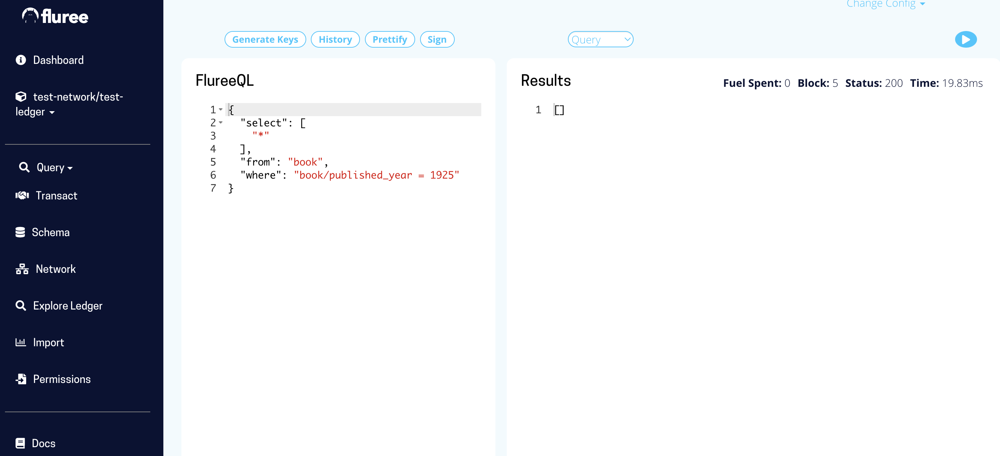

# local-fluree-graph-database
Tutorial on running Fluree graph database docker container locally

#
There are 3 ways to run Fluree locally, but in this tutorial we will focus on running it with docker only. For other ways of running Fluree you can have a look their official [documentation](https://developers.flur.ee/docs/overview/getting_started/#install-fluree)

#
## Now we will learn how to install Fluree with docker and running CRUD queries in just 11 steps. 

## Step 1 - pull docker image
This tutorial assumes that your machine has already Docker installed. If not, then you have to install Docker by following [this document](https://docs.docker.com/get-docker/). 
Once Docker is installed, we can pull fluree image from docker-hub using following terminal command: 
```
docker pull fluree/ledger
```
## Step 2 - run fluree docker container
After downloading docker image of fluree, we can run docker container created from that image by following terminal command:
```
docker run -d --restart=always -p 8090:8090 fluree/ledger:latest
```
This will launch Fluree admin UI at port 8090, make sure that port 8090 is not used by other processes.

## Step 3 - visit localhost:8090
If you did previous steps, and there was no problems, you should be able to see the following UI when you visit http://localhost:8090



Yes, it is that easy to run Fluree, only 3 steps and voilà!

## Step 4 - add ledger
Click 'Add Ledger' button to add ledger:

Name a new network(or use existing) and new ledger name: 


End result should look like this:


## Step 5 - create schema
In this tutorial I took example of 'book' schema to demonstrate creating, updating, deleting, querying data on Fluree database.

Go to 'Transact' menu and run following transaction to create collection(analog of table in relational databases):
```
[
  {
    "_id": "_collection",
    "name": "book"
  }
]
```


## Step 6 - create predicates
Go to 'Transact' menu and run following transaction to add predicates(fields of table in relational databases): 
```
[
  {
    "_id": "_predicate",
    "name": "book/title",
    "doc": "The books's title",
    "unique": true,
    "type": "string"
  },
  {
    "_id": "_predicate",
    "name": "book/author",
    "doc": "The book author's full name.",
    "type": "string",
    "index": true
  },
  {
    "_id": "_predicate",
    "name": "book/published_year",
    "doc": "The book's published year",
    "type": "int",
    "index": true
  }
]
```

## Step 7 - create records in the collection
Go to 'Transact' menu and run following transaction to add a record into 'book' collection: 
```
[
  {
    "_id": "book",
    "title": "The Great Gatsby",
    "author": "F. Scott Fitzgerald",
    "published_year": 1926
  }
]
```

## Step 8 - run queries on the collection
Go to 'Query' menu, select 'FlureeQL' and run following query to check records in the collection: 
```
{
  "select": [
    "*"
  ],
  "from": "book"
}
```
Outcome looks like this:


## Step 9 - run where queries on the collection
Go to 'Query' menu, select 'FlureeQL' and run following query to check how where queries work : 
```
{
  "select": [
    "*"
  ],
  "from": "book",
  "where": "book/published_year = 1925"
}
```
Outcome looks like this:


## Step 10 - update records in the collection
Go to 'Transact' menu and run following transaction to add a update specific record in 'book' collection: 
```
[
  {
    "_id": [
      "book/title",
      "The Great Gatsby"
    ],
    "published_year": 1925
  }
]
```

## Step 11 - delete records from the collection
Go to 'Transact' menu and run following transaction to delete specific records in 'book' collection: 
```
[
  {
    "_id": ["book/title", "Wrong book"],
    "_action": "delete"
  }
]
```
